# OUTE Database - Entity Relationship Diagram

> Complete Mermaid ER diagram for all 25 tables across 7 bounded contexts.
> Paste into any Mermaid-compatible renderer (GitHub, dbdocs, mermaid.live).

```mermaid
erDiagram
    %% ═══════════════════════════════════════
    %% BOUNDED CONTEXT 1: Identity & Access
    %% ═══════════════════════════════════════

    users {
        uuid id PK "UUID v7"
        varchar email UK "RFC 5322, lowercase"
        varchar password_hash "bcrypt"
        varchar name "1-255 chars"
        varchar avatar_url "nullable"
        timestamptz last_login_at "nullable"
        timestamptz created_at
        timestamptz updated_at
        timestamptz deleted_at "soft delete"
    }

    organizations {
        uuid id PK "UUID v7"
        varchar name "1-255 chars"
        varchar slug UK "URL-friendly"
        varchar logo_url "nullable"
        jsonb settings "org preferences"
        timestamptz created_at
        timestamptz updated_at
        timestamptz deleted_at "soft delete"
    }

    organization_members {
        uuid id PK "UUID v7"
        uuid organization_id FK
        uuid user_id FK
        user_role role "owner/admin/member/viewer"
        timestamptz joined_at
        timestamptz created_at
        timestamptz updated_at
        timestamptz deleted_at "soft delete"
    }

    refresh_tokens {
        uuid id PK "UUID v7"
        uuid user_id FK
        varchar token_hash UK "SHA-256 hash"
        varchar device_info "nullable"
        timestamptz expires_at
        boolean revoked "default false"
        timestamptz created_at
        timestamptz updated_at
        timestamptz deleted_at "soft delete"
    }

    %% ═══════════════════════════════════════
    %% BOUNDED CONTEXT 2: Project Management
    %% ═══════════════════════════════════════

    projects {
        uuid id PK "UUID v7"
        uuid organization_id FK
        uuid created_by FK "user who created"
        varchar code UK "OUT-101, OUT-102..."
        varchar name "1-255 chars"
        text description "nullable"
        project_status status "draft/active/archived"
        project_type type "greenfield/brownfield"
        integer progress_percent "0-100"
        timestamptz created_at
        timestamptz updated_at
        timestamptz deleted_at "soft delete"
    }

    project_members {
        uuid id PK "UUID v7"
        uuid project_id FK
        uuid user_id FK
        varchar role "lead/architect/developer/viewer"
        timestamptz created_at
        timestamptz updated_at
        timestamptz deleted_at "soft delete"
    }

    tags {
        uuid id PK "UUID v7"
        uuid organization_id FK
        varchar name UK "per org unique"
        varchar color "hex color"
        varchar category "nullable: tech/maturity/custom"
        timestamptz created_at
        timestamptz updated_at
        timestamptz deleted_at "soft delete"
    }

    project_tags {
        uuid id PK "UUID v7"
        uuid project_id FK
        uuid tag_id FK
        timestamptz created_at
    }

    %% ═══════════════════════════════════════
    %% BOUNDED CONTEXT 3: Interview & Chat
    %% ═══════════════════════════════════════

    interviews {
        uuid id PK "UUID v7"
        uuid project_id FK
        uuid conducted_by FK "user_id"
        varchar title "1-255 chars"
        interview_status status "scheduled/in_progress/completed/cancelled"
        varchar interview_code "INT-2024-XXX"
        integer total_messages "counter cache"
        timestamptz started_at "nullable"
        timestamptz completed_at "nullable"
        timestamptz created_at
        timestamptz updated_at
        timestamptz deleted_at "soft delete"
    }

    messages {
        uuid id PK "UUID v7"
        uuid interview_id FK
        uuid user_id FK "nullable - null for AI msgs"
        message_sender sender "user/ai/system"
        message_type type "text/code/image"
        text content "message body"
        jsonb metadata "nullable: model, tokens, refs"
        timestamptz created_at
        timestamptz updated_at
        timestamptz deleted_at "soft delete"
    }

    interview_notes {
        uuid id PK "UUID v7"
        uuid interview_id FK "one-to-one"
        uuid last_edited_by FK "user_id"
        text summary "nullable"
        text content "rich text notes"
        jsonb metrics "progress/hours/budget"
        jsonb tags_snapshot "tags at time of note"
        timestamptz created_at
        timestamptz updated_at
        timestamptz deleted_at "soft delete"
    }

    %% ═══════════════════════════════════════
    %% BOUNDED CONTEXT 4: SDLC Template Engine
    %% ═══════════════════════════════════════

    sdlc_templates {
        uuid id PK "UUID v7"
        varchar version UK "v4.0, v5.0"
        varchar name "Universal Software Template"
        text description "nullable"
        boolean is_active "current default"
        integer total_milestones "14 (Phase0+M1-M13)"
        integer total_epics "40+"
        integer total_issues "80+"
        timestamptz published_at
        timestamptz created_at
        timestamptz updated_at
        timestamptz deleted_at "soft delete"
    }

    template_milestones {
        uuid id PK "UUID v7"
        uuid template_id FK
        integer sort_order "0-13"
        varchar code "PHASE-0, M1, M2..."
        varchar name "Governance, Discovery..."
        text objective "milestone goal"
        jsonb applicability_tags "WEB/MOBILE/DATA/AI..."
        boolean is_required "mandatory or optional"
        timestamptz created_at
        timestamptz updated_at
        timestamptz deleted_at "soft delete"
    }

    template_epics {
        uuid id PK "UUID v7"
        uuid milestone_id FK
        integer sort_order
        varchar name "Regulatory Assessment..."
        text description "nullable"
        jsonb applicability_tags "ENTERPRISE/STARTUP..."
        timestamptz created_at
        timestamptz updated_at
        timestamptz deleted_at "soft delete"
    }

    template_issues {
        uuid id PK "UUID v7"
        uuid epic_id FK
        uuid parent_issue_id FK "nullable - sub-issues"
        integer sort_order
        varchar name "GDPR Compliance..."
        text how_to_fill "instructions"
        text description_template "markdown template"
        jsonb applicability_tags "tags array"
        jsonb metadata "extra config"
        integer depth "0=issue, 1=sub-issue"
        timestamptz created_at
        timestamptz updated_at
        timestamptz deleted_at "soft delete"
    }

    template_checklist_items {
        uuid id PK "UUID v7"
        uuid issue_id FK
        integer sort_order
        text label "checklist text"
        boolean is_critical "blocks progress?"
        timestamptz created_at
        timestamptz updated_at
        timestamptz deleted_at "soft delete"
    }

    %% ═══════════════════════════════════════
    %% BOUNDED CONTEXT 5: Estimation Engine
    %% ═══════════════════════════════════════

    estimation_sessions {
        uuid id PK "UUID v7"
        uuid project_id FK
        uuid template_id FK "pinned version"
        uuid started_by FK "user_id"
        varchar status "draft/in_progress/completed/abandoned"
        integer overall_progress "0-100"
        jsonb config "selected tags, project type"
        timestamptz started_at "nullable"
        timestamptz completed_at "nullable"
        timestamptz created_at
        timestamptz updated_at
        timestamptz deleted_at "soft delete"
    }

    estimation_milestone_statuses {
        uuid id PK "UUID v7"
        uuid session_id FK
        uuid milestone_id FK "template_milestones"
        milestone_tracking_status status "pending/in_progress/completed/skipped/needs_revisit/not_applicable"
        text skip_reason "nullable - why skipped"
        varchar reviewer_verdict "nullable: confirmed_skip/must_revisit/not_needed"
        uuid reviewed_by FK "nullable - AI or user"
        integer progress_percent "0-100"
        timestamptz started_at "nullable"
        timestamptz completed_at "nullable"
        timestamptz created_at
        timestamptz updated_at
        timestamptz deleted_at "soft delete"
    }

    estimation_responses {
        uuid id PK "UUID v7"
        uuid session_id FK
        uuid issue_id FK "template_issues"
        uuid answered_by FK "user_id"
        text answer "user response text"
        jsonb structured_data "nullable - parsed data"
        boolean is_complete "all required fields filled"
        timestamptz created_at
        timestamptz updated_at
        timestamptz deleted_at "soft delete"
    }

    estimation_checklist_results {
        uuid id PK "UUID v7"
        uuid session_id FK
        uuid checklist_item_id FK "template_checklist_items"
        boolean is_checked "true/false"
        text note "nullable - user comment"
        uuid checked_by FK "user_id"
        timestamptz checked_at "nullable"
        timestamptz created_at
        timestamptz updated_at
        timestamptz deleted_at "soft delete"
    }

    estimation_outputs {
        uuid id PK "UUID v7"
        uuid session_id FK
        varchar output_type "summary/detailed/executive"
        jsonb result "hours/budget/decisions/recommendations"
        jsonb architecture_decisions "tech stack, patterns"
        jsonb compliance_summary "regulatory checklist"
        integer confidence_score "0-100"
        integer estimated_hours_min "nullable"
        integer estimated_hours_max "nullable"
        integer estimated_budget_min "nullable"
        integer estimated_budget_max "nullable"
        varchar currency "BRL/USD/EUR"
        timestamptz generated_at
        timestamptz created_at
        timestamptz updated_at
        timestamptz deleted_at "soft delete"
    }

    %% ═══════════════════════════════════════
    %% BOUNDED CONTEXT 6: Integrations
    %% ═══════════════════════════════════════

    integration_connections {
        uuid id PK "UUID v7"
        uuid organization_id FK
        uuid created_by FK "user_id"
        integration_provider provider "linear/jira/asana/github/gitlab"
        varchar name "My Linear Workspace"
        jsonb credentials_encrypted "API keys, tokens (encrypted)"
        jsonb config "workspace IDs, project keys"
        boolean is_active "enabled/disabled"
        timestamptz last_synced_at "nullable"
        timestamptz created_at
        timestamptz updated_at
        timestamptz deleted_at "soft delete"
    }

    export_sessions {
        uuid id PK "UUID v7"
        uuid estimation_session_id FK
        uuid integration_connection_id FK
        uuid triggered_by FK "user_id"
        export_status status "pending/in_progress/completed/failed"
        integer items_total "total items to export"
        integer items_exported "items successfully exported"
        jsonb error_log "nullable - failure details"
        jsonb export_config "what to export, mapping rules"
        timestamptz started_at "nullable"
        timestamptz completed_at "nullable"
        timestamptz created_at
        timestamptz updated_at
        timestamptz deleted_at "soft delete"
    }

    export_mappings {
        uuid id PK "UUID v7"
        uuid export_session_id FK
        varchar internal_entity_type "milestone/epic/issue/checklist"
        uuid internal_entity_id "ref to template entity"
        varchar external_entity_type "project/epic/issue/task"
        varchar external_entity_id "Linear/Jira ID"
        varchar external_url "nullable - link to external"
        jsonb sync_metadata "last sync state"
        timestamptz last_synced_at
        timestamptz created_at
        timestamptz updated_at
        timestamptz deleted_at "soft delete"
    }

    %% ═══════════════════════════════════════
    %% BOUNDED CONTEXT 7: Audit
    %% ═══════════════════════════════════════

    audit_log {
        uuid id PK "UUID v7"
        uuid organization_id FK "nullable"
        uuid user_id FK "nullable"
        varchar entity_type "user/project/interview..."
        uuid entity_id "affected entity"
        varchar action "create/update/delete/export"
        jsonb old_values "nullable - before"
        jsonb new_values "nullable - after"
        varchar ip_address "nullable"
        varchar user_agent "nullable"
        timestamptz created_at "immutable, no update/delete"
    }

    %% ═══════════════════════════════════════
    %% RELATIONSHIPS
    %% ═══════════════════════════════════════

    %% IAM
    users ||--o{ organization_members : "has memberships"
    organizations ||--o{ organization_members : "has members"
    users ||--o{ refresh_tokens : "has tokens"

    %% Project Management
    organizations ||--o{ projects : "owns"
    users ||--o{ projects : "creates"
    projects ||--o{ project_members : "has members"
    users ||--o{ project_members : "participates in"
    organizations ||--o{ tags : "defines"
    projects ||--o{ project_tags : "tagged with"
    tags ||--o{ project_tags : "applied to"

    %% Interview & Chat
    projects ||--o{ interviews : "has interviews"
    users ||--o{ interviews : "conducts"
    interviews ||--o{ messages : "contains"
    users ||--o{ messages : "sends"
    interviews ||--|| interview_notes : "has notes"
    users ||--o{ interview_notes : "edits"

    %% SDLC Template
    sdlc_templates ||--o{ template_milestones : "has milestones"
    template_milestones ||--o{ template_epics : "has epics"
    template_epics ||--o{ template_issues : "has issues"
    template_issues ||--o{ template_issues : "has sub-issues"
    template_issues ||--o{ template_checklist_items : "has checklist"

    %% Estimation Engine
    projects ||--o{ estimation_sessions : "estimated via"
    sdlc_templates ||--o{ estimation_sessions : "uses template"
    users ||--o{ estimation_sessions : "starts"
    estimation_sessions ||--o{ estimation_milestone_statuses : "tracks milestones"
    template_milestones ||--o{ estimation_milestone_statuses : "tracked in"
    estimation_sessions ||--o{ estimation_responses : "collects answers"
    template_issues ||--o{ estimation_responses : "answered for"
    users ||--o{ estimation_responses : "answers"
    estimation_sessions ||--o{ estimation_checklist_results : "checks items"
    template_checklist_items ||--o{ estimation_checklist_results : "checked in"
    users ||--o{ estimation_checklist_results : "checks"
    estimation_sessions ||--o{ estimation_outputs : "generates"

    %% Integrations
    organizations ||--o{ integration_connections : "connects"
    users ||--o{ integration_connections : "sets up"
    estimation_sessions ||--o{ export_sessions : "exported via"
    integration_connections ||--o{ export_sessions : "used by"
    users ||--o{ export_sessions : "triggers"
    export_sessions ||--o{ export_mappings : "maps entities"

    %% Audit
    organizations ||--o{ audit_log : "audited"
    users ||--o{ audit_log : "performed by"
```

