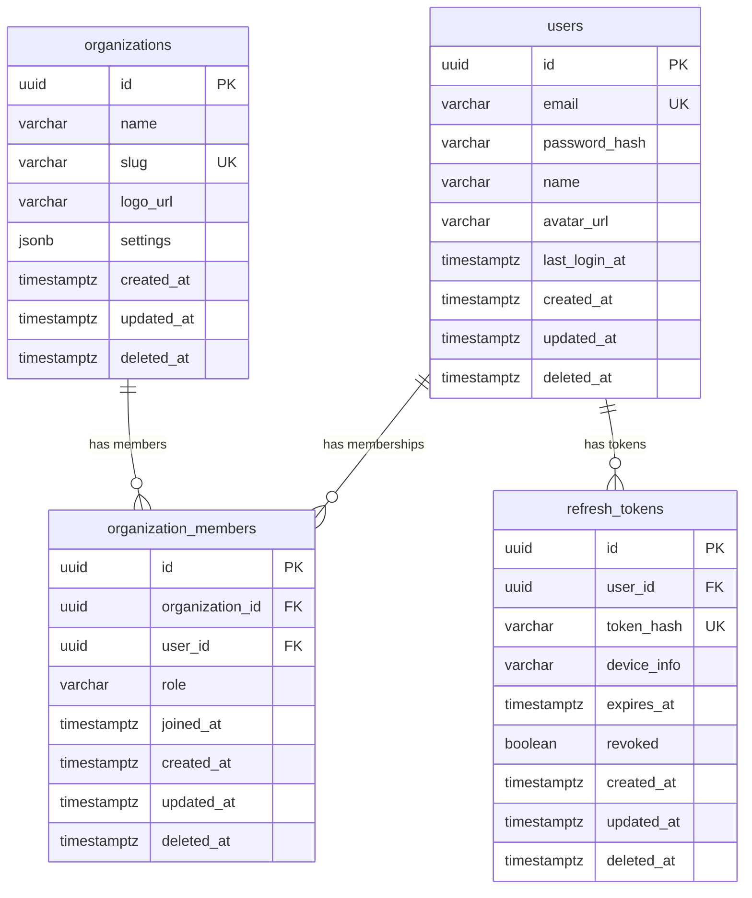
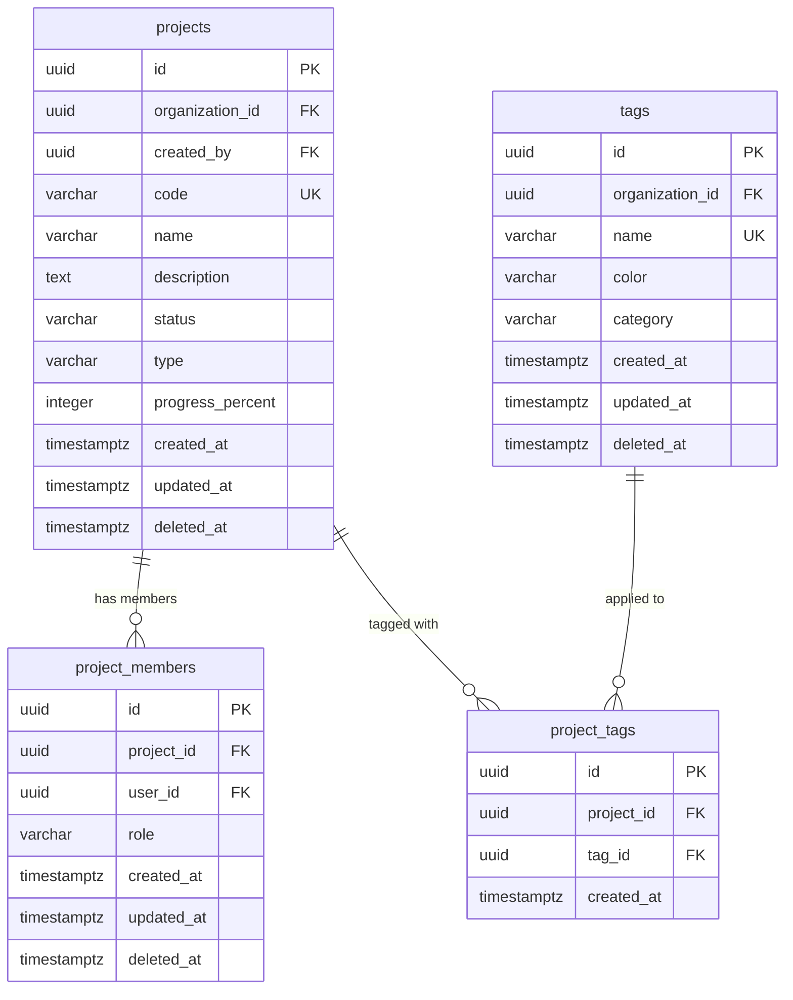
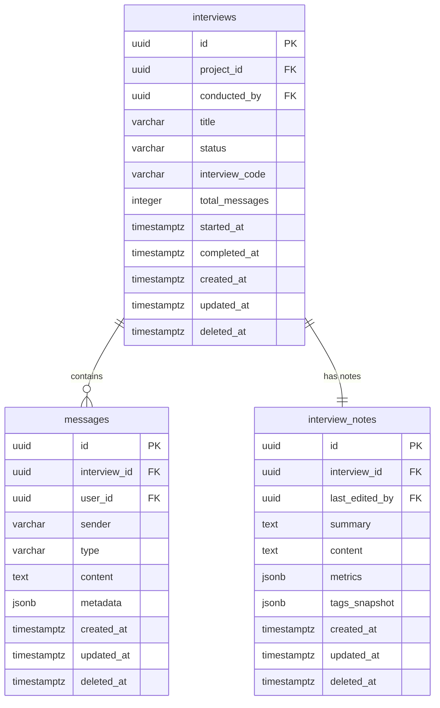
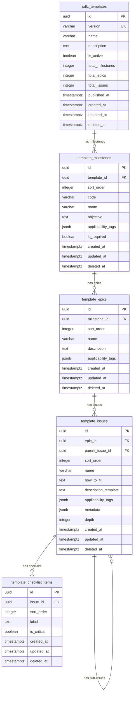
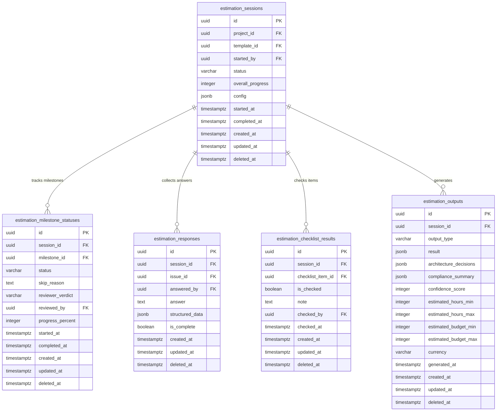
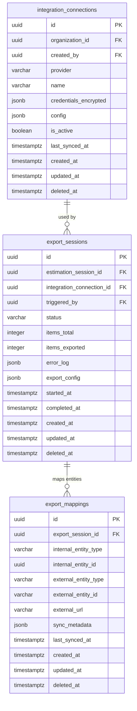
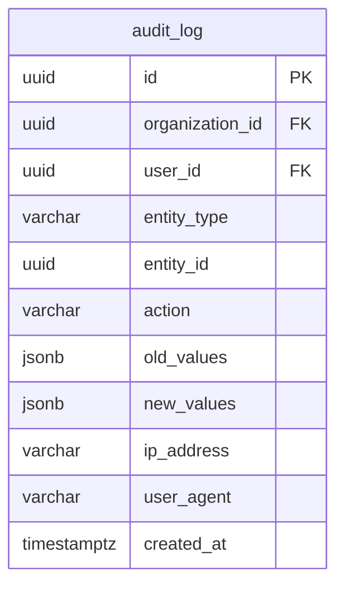
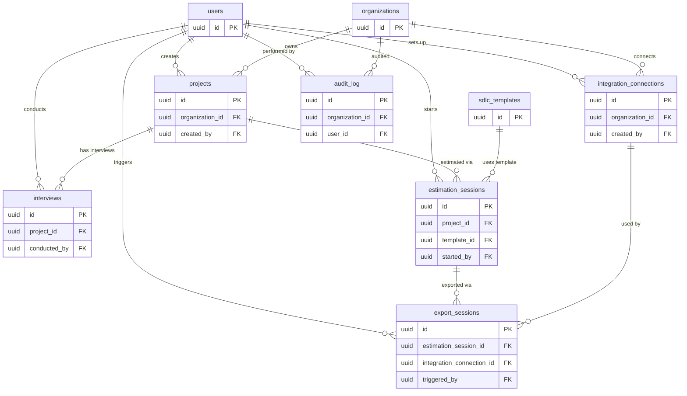

# OUTE Database - Excalidraw Mermaid Diagrams

> 8 diagramas separados por bounded context para importar no Excalidraw.
> **Como importar**: Menu > Insert > Mermaid > colar o diagrama desejado.
> Diagramas menores renderizam melhor no Excalidraw do que um unico diagrama gigante.

---

## 1. Identity & Access (IAM)

---

## 2. Project Management

---

## 3. Interview & Chat

---

## 4. SDLC Template Engine

---

## 5. Estimation Engine

---

## 6. Integrations

---

## 7. Audit

---

## 8. Cross-Context Relationships

> Diagrama mostrando como os bounded contexts se conectam entre si.
> Tabelas simplificadas (apenas PK/FK) para foco nos relacionamentos.

