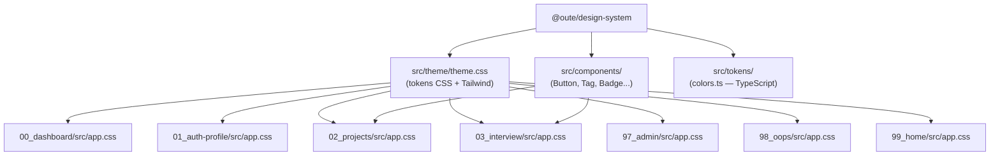
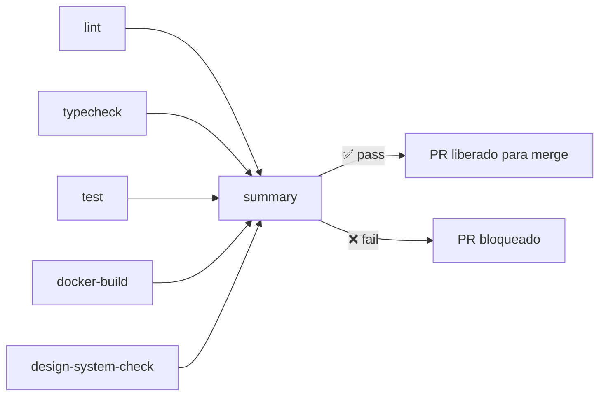

# OUTE Design System

> Fonte única de verdade visual para todos os packages do monorepo OUTE.

---

## Índice

1. [Visão Geral](#1-visão-geral)
2. [Arquitetura](#2-arquitetura)
3. [Tokens de Design](#3-tokens-de-design)
   - [Paleta de Cores](#31-paleta-de-cores)
   - [Dark Theme](#32-dark-theme)
   - [Cores Semânticas](#33-cores-semânticas)
   - [Tipografia](#34-tipografia)
4. [Componentes](#4-componentes)
   - [Button](#41-button)
   - [SectionHeader](#42-sectionheader)
   - [StatusBadge](#43-statusbadge)
   - [Tag](#44-tag)
   - [ProgressBar](#45-progressbar)
   - [MetricDisplay](#46-metricdisplay)
   - [OuteLogo](#47-outelogo)
5. [Como usar em um package](#5-como-usar-em-um-package)
6. [Como criar um novo package](#6-como-criar-um-novo-package)
7. [Enforcement via CI](#7-enforcement-via-ci)
8. [Contribuindo com o Design System](#8-contribuindo-com-o-design-system)

---

## 1. Visão Geral

O `@oute/design-system` é o pacote central de UI do monorepo. Ele define:

- **Tokens visuais** — cores, tipografia, espaçamento — como CSS custom properties via Tailwind 4 `@theme`
- **Componentes Svelte** reutilizáveis que consomem esses tokens
- **Regra de ouro**: nenhum package de frontend define `@theme` ou cores hex localmente

```
packages/
├── design-system/          ← fonte da verdade
│   ├── src/theme/theme.css ← tokens CSS (@theme)
│   ├── src/tokens/         ← tokens TypeScript (para uso em scripts)
│   └── src/components/     ← componentes Svelte exportados
├── 00_dashboard/
├── 01_auth-profile/
├── 02_projects/
├── 03_interview/           ← referência visual aprovada
├── 97_admin/
├── 98_oops/
└── 99_home/
```

Cada package SvelteKit consome o DS com uma única linha:

```css
/* src/app.css */
@import '../../design-system/src/theme/theme.css';
```

---

## 2. Arquitetura



### Fluxo de tokens

```
theme.css (@theme block)
    └─→ CSS custom properties (--color-primary-500, --color-dark-bg, ...)
            └─→ Classes Tailwind (bg-primary-500, text-dark-bg, ...)
                    └─→ Componentes .svelte
```

O Tailwind 4 lê o bloco `@theme` e gera automaticamente as classes utilitárias correspondentes. Não é necessário nenhum `tailwind.config.js`.

---

## 3. Tokens de Design

### 3.1 Paleta de Cores

#### Primary — Cyan

| Token | Valor | Preview |
|---|---|---|
| `--color-primary-50` | `#ecf7fc` | ░ claro |
| `--color-primary-100` | `#d9effa` | |
| `--color-primary-200` | `#a8ddf4` | |
| `--color-primary-300` | `#77cbee` | |
| `--color-primary-400` | `#46b9e9` | |
| `--color-primary-500` | `#06bcf9` | **principal** |
| `--color-primary-600` | `#00d2ff` | hover |
| `--color-primary-700` | `#0597c9` | |
| `--color-primary-800` | `#047a99` | |
| `--color-primary-900` | `#025d69` | ░ escuro |

Classes Tailwind geradas: `bg-primary-500`, `text-primary-500`, `border-primary-500`, `ring-primary-500`, etc.

#### Secondary — Teal

| Token | Valor |
|---|---|
| `--color-secondary-500` | `#1596b9` |
| `--color-secondary-600` | `#0597c9` |

#### Neutral — Grayscale

| Token | Valor | Uso típico |
|---|---|---|
| `--color-neutral-0` | `#ffffff` | branco puro |
| `--color-neutral-100` | `#f3f4f6` | backgrounds claros |
| `--color-neutral-200` | `#e5e7eb` | texto body em dark |
| `--color-neutral-300` | `#d1d5db` | labels, subtítulos |
| `--color-neutral-400` | `#9ca3af` | ícones inativos |
| `--color-neutral-500` | `#6b7280` | texto secundário |
| `--color-neutral-600` | `#4b5563` | bordas sutis |
| `--color-neutral-700` | `#374151` | |
| `--color-neutral-800` | `#1f2937` | |
| `--color-neutral-900` | `#111827` | |

---

### 3.2 Dark Theme

Esses tokens definem as camadas visuais da interface escura:

| Token | Valor | Uso |
|---|---|---|
| `--color-dark-bg` | `#000000` | fundo da página (raiz) |
| `--color-dark-sidebar` | `#0a1519` | sidebar lateral |
| `--color-dark-surface` | `#162a31` | cards, painéis, modais |
| `--color-dark-border` | `#21404a` | bordas de separação |

**Hierarquia visual:**
```
#000000  (dark-bg)       ← fundo mais escuro
  └─ #0a1519 (dark-sidebar)  ← sidebar
  └─ #162a31 (dark-surface)  ← cards sobre o bg
       └─ #21404a (dark-border) ← bordas dos cards
```

---

### 3.3 Cores Semânticas

| Token | Valor | Uso |
|---|---|---|
| `--color-success` | `#10b981` | confirmações, status OK |
| `--color-warning` | `#f59e0b` | alertas, atenção |
| `--color-error` | `#ef4444` | erros, destruição |
| `--color-info` | `#0ea5e9` | informativo, neutro |
| `--color-accent-pink` | `#EC4899` | destaque especial |

Para variantes transparentes, usar `color-mix`:

```css
/* 10% de opacidade */
background: color-mix(in srgb, var(--color-error) 10%, transparent);

/* 30% de opacidade */
border-color: color-mix(in srgb, var(--color-error) 30%, transparent);
```

> ⚠️ **Nunca usar `rgba(239, 68, 68, 0.1)`** — sempre via `color-mix` com a CSS var.

---

### 3.4 Tipografia

| Token | Valor |
|---|---|
| `--font-sans` | `'Inter', -apple-system, BlinkMacSystemFont, 'Segoe UI', Roboto, ...` |
| `--font-mono` | `'Fira Code', 'Cascadia Code', Monaco, Menlo, ...` |

A fonte Inter é carregada via `theme.css`. **Não importar Google Fonts separadamente** em nenhum package.

---

## 4. Componentes

Todos os componentes são exportados pelo barrel:

```typescript
import { Button, SectionHeader, StatusBadge, Tag, ProgressBar, MetricDisplay, OuteLogo } from '@oute/design-system';
```

---

### 4.1 Button

Botão versátil que renderiza `<button>` ou `<a>` dependendo da presença da prop `href`.

#### Props

| Prop | Tipo | Padrão | Descrição |
|---|---|---|---|
| `variant` | `'primary' \| 'outline' \| 'icon' \| 'ghost'` | `'primary'` | Estilo visual |
| `size` | `'sm' \| 'md' \| 'lg'` | `'md'` | Tamanho |
| `href` | `string` | `undefined` | Renderiza como `<a>` quando definido |
| `disabled` | `boolean` | `false` | Estado desabilitado |
| `type` | `'button' \| 'submit' \| 'reset'` | `'button'` | Tipo HTML |

#### Variantes

```svelte
<!-- Primary: ação principal, fundo ciano -->
<Button variant="primary">Salvar</Button>

<!-- Outline: ação secundária, borda ciano -->
<Button variant="outline">Cancelar</Button>

<!-- Icon: apenas ícone, sem background -->
<Button variant="icon">
  <IconTrash />
</Button>

<!-- Ghost: texto sutil, hover com fundo suave -->
<Button variant="ghost">Ver detalhes</Button>
```

#### Tamanhos

```svelte
<Button size="sm">Pequeno</Button>
<Button size="md">Médio (padrão)</Button>
<Button size="lg">Grande</Button>
```

#### Como link

```svelte
<Button href="/dashboard" variant="primary">Ir para Dashboard</Button>
```

#### Visual de cada variante

| Variante | Background | Texto | Hover |
|---|---|---|---|
| `primary` | `bg-primary-500` | `text-dark-bg` (escuro) | `bg-primary-600` |
| `outline` | transparente | `text-primary-500` | `bg-primary-500/10` |
| `icon` | transparente | `text-neutral-400` | `text-neutral-200` |
| `ghost` | transparente | `text-neutral-400` | `text-neutral-200 bg-white/5` |

---

### 4.2 SectionHeader

Cabeçalho de seção com label uppercase e slot opcional para ações à direita.

#### Props

| Prop | Tipo | Padrão | Descrição |
|---|---|---|---|
| `label` | `string` | — | Texto do título |

#### Slots

| Slot | Descrição |
|---|---|
| `actions` | Conteúdo à direita (botões, ícones) |

#### Exemplos

```svelte
<!-- Simples -->
<SectionHeader label="Métricas de Performance" />

<!-- Com ação -->
<SectionHeader label="Candidatos">
  <svelte:fragment slot="actions">
    <Button variant="icon"><IconPlus /></Button>
  </svelte:fragment>
</SectionHeader>
```

#### Visual

```
MÉTRICAS DE PERFORMANCE          [+ Adicionar]
────────────────────────────────────────────
```

---

### 4.3 StatusBadge

Indicador de status com suporte a animação de pulso.

#### Props

| Prop | Tipo | Padrão | Descrição |
|---|---|---|---|
| `status` | `'success' \| 'warning' \| 'error' \| 'info' \| 'neutral'` | `'neutral'` | Tipo semântico |
| `label` | `string` | — | Texto exibido |
| `variant` | `'pill' \| 'dot'` | `'pill'` | Formato visual |
| `pulse` | `boolean` | `false` | Animação de pulso |

#### Exemplos

```svelte
<!-- Pill padrão -->
<StatusBadge status="success" label="Aprovado" />
<StatusBadge status="warning" label="Em revisão" />
<StatusBadge status="error" label="Reprovado" />
<StatusBadge status="info" label="Pendente" />

<!-- Com pulso (ex: "ao vivo") -->
<StatusBadge status="success" label="Em andamento" pulse />

<!-- Dot (apenas indicador sem texto) -->
<StatusBadge status="error" variant="dot" label="Offline" />
```

#### Mapeamento de cores

| Status | Cor de fundo | Cor do texto |
|---|---|---|
| `success` | `color-mix(success, 15%)` | `--color-success` |
| `warning` | `color-mix(warning, 15%)` | `--color-warning` |
| `error` | `color-mix(error, 15%)` | `--color-error` |
| `info` | `color-mix(info, 15%)` | `--color-info` |
| `neutral` | `color-mix(neutral-500, 15%)` | `--color-neutral-400` |

---

### 4.4 Tag

Tag removível para categorias, habilidades, filtros.

#### Props

| Prop | Tipo | Padrão | Descrição |
|---|---|---|---|
| `label` | `string` | — | Texto da tag |
| `removable` | `boolean` | `false` | Exibe botão de remoção |

#### Eventos

| Evento | Quando |
|---|---|
| `remove` | Usuário clica no × (somente se `removable`) |

#### Exemplos

```svelte
<!-- Tag simples -->
<Tag label="TypeScript" />

<!-- Tag removível com handler -->
<Tag label="React" removable on:remove={() => removerHabilidade('React')} />

<!-- Em lista dinâmica -->
{#each habilidades as skill}
  <Tag label={skill} removable on:remove={() => remover(skill)} />
{/each}
```

#### Visual

```
[ TypeScript ]   [ React ×]
```

---

### 4.5 ProgressBar

Barra de progresso com gradiente animado e tooltip.

#### Props

| Prop | Tipo | Padrão | Descrição |
|---|---|---|---|
| `percentage` | `number` | `0` | Valor de 0 a 100 |

#### Exemplos

```svelte
<ProgressBar percentage={75} />
<ProgressBar percentage={42} />
<ProgressBar percentage={100} />
```

#### Comportamento

- Gradiente: `var(--color-primary-500)` → `var(--color-primary-600)`
- Track: `bg-neutral-800`, altura `h-3`, bordas arredondadas
- Hover: tooltip exibindo `"75%"`
- Acessível: `role="progressbar"`, `aria-valuenow`, `aria-valuemin`, `aria-valuemax`

---

### 4.6 MetricDisplay

Exibição de métricas numéricas com label e unidade.

#### Props

| Prop | Tipo | Padrão | Descrição |
|---|---|---|---|
| `value` | `string \| number` | — | Valor principal |
| `unit` | `string` | — | Unidade (ex: `%`, `pts`, `ms`) |
| `label` | `string` | — | Rótulo abaixo do valor |
| `size` | `'sm' \| 'md' \| 'lg'` | `'md'` | Tamanho do display |

#### Exemplos

```svelte
<MetricDisplay value={87} unit="%" label="Precisão técnica" size="lg" />
<MetricDisplay value={4.2} unit="/5" label="Comunicação" />
<MetricDisplay value="Alto" label="Potencial" size="sm" />
```

#### Visual

```
   87 %
Precisão técnica
```

O valor é renderizado em `text-primary-500`, a unidade em `text-neutral-400`, e o label em `text-neutral-500`.

---

### 4.7 OuteLogo

Logo oficial da OUTE com variações de tamanho e layout.

#### Props

| Prop | Tipo | Padrão | Descrição |
|---|---|---|---|
| `size` | `'xs' \| 'sm' \| 'md' \| 'lg'` | `'md'` | Tamanho |
| `showSlogan` | `boolean` | `false` | Exibe "A jornada começa aqui!" |
| `vertical` | `boolean` | `false` | Layout vertical (logo acima do nome) |

#### Exemplos

```svelte
<!-- Header da aplicação -->
<OuteLogo size="sm" />

<!-- Tela de login -->
<OuteLogo size="lg" showSlogan vertical />

<!-- Favicon/miniatura -->
<OuteLogo size="xs" />
```

---

## 5. Como usar em um package

### 5.1 Configurar `src/app.css`

```css
/* packages/meu-package/src/app.css */
@import '../../design-system/src/theme/theme.css';
```

> Não adicione mais nada nesse arquivo. Todos os tokens, base styles e utilitários vêm do DS.

### 5.2 Configurar `src/routes/+layout.svelte`

```svelte
<!-- packages/meu-package/src/routes/+layout.svelte -->
<script lang="ts">
  import '../app.css';
</script>

<slot />
```

### 5.3 Usar tokens nos componentes

**Classes Tailwind (preferido):**

```svelte
<div class="bg-dark-bg text-neutral-200 border border-dark-border rounded-lg p-4">
  <h2 class="text-primary-500 font-semibold">Título</h2>
  <p class="text-neutral-500 text-sm">Subtítulo</p>
</div>
```

**CSS custom properties (para valores dinâmicos):**

```svelte
<style>
  .minha-classe {
    background: var(--color-dark-surface);
    border-color: color-mix(in srgb, var(--color-primary-500) 30%, transparent);
  }
</style>
```

### 5.4 Usar componentes do DS

```svelte
<script lang="ts">
  import { Button, StatusBadge, Tag, ProgressBar } from '@oute/design-system';
</script>

<Button variant="primary" on:click={salvar}>Salvar avaliação</Button>

<StatusBadge status="success" label="Aprovado" pulse />

<ProgressBar percentage={73} />

{#each habilidades as h}
  <Tag label={h} removable on:remove={() => remover(h)} />
{/each}
```

### 5.5 Configurar Dockerfile

O builder precisa copiar o design-system para resolver o import CSS:

```dockerfile
FROM node:20-alpine AS builder

WORKDIR /app

COPY package.json package-lock.json tsconfig.json .eslintrc.json .prettierrc ./
COPY packages/meu-package ./packages/meu-package
COPY packages/design-system ./packages/design-system   # ← obrigatório
COPY shared ./shared

RUN npm install --legacy-peer-deps

WORKDIR /app/packages/meu-package
RUN npm run build
```

---

## 6. Como criar um novo package

Siga o padrão `NN_nome` (ex: `04_relatorios`). O CI detecta automaticamente qualquer pasta com prefixo numérico.

### Checklist mínimo

```
packages/04_relatorios/
├── src/
│   ├── app.css                    ← @import do DS
│   └── routes/
│       └── +layout.svelte         ← import '../app.css'
├── Dockerfile                     ← COPY packages/design-system
├── package.json                   ← "@oute/design-system": "^1.0.0"
├── svelte.config.js
├── vite.config.ts
└── tsconfig.json
```

### `src/app.css`

```css
@import '../../design-system/src/theme/theme.css';
```

### `src/routes/+layout.svelte`

```svelte
<script lang="ts">
  import '../app.css';
</script>

<slot />
```

### `package.json` (dependências mínimas)

```json
{
  "dependencies": {
    "@oute/design-system": "^1.0.0",
    "@oute/shared": "^1.0.0"
  }
}
```

### `Dockerfile` (bloco builder)

```dockerfile
COPY packages/04_relatorios ./packages/04_relatorios
COPY packages/design-system ./packages/design-system
COPY shared ./shared
```

> Se qualquer um desses itens estiver faltando, o PR será **bloqueado automaticamente** pelo CI.

---

## 7. Enforcement via CI

O workflow `.github/workflows/1-pull-request.yml` executa em todo PR para `develop`, `staging` e `main`.

### Jobs executados



### `design-system-check` — detalhes

O job descobre automaticamente todos os packages `NN_*`:

```bash
find packages -maxdepth 1 -type d -regex 'packages/[0-9]+_.*'
```

Para cada package encontrado, valida:

| Verificação | Critério |
|---|---|
| `src/app.css` existe | arquivo presente |
| `src/app.css` importa o DS | contém `design-system/src/theme/theme.css` |
| `Dockerfile` copia o DS | contém `design-system` |

**Exemplo de saída quando tudo passa:**

```
Packages found: 00_dashboard 01_auth-profile 02_projects 03_interview 97_admin 98_oops 99_home
✅ 00_dashboard: compliant
✅ 01_auth-profile: compliant
✅ 02_projects: compliant
✅ 03_interview: compliant
✅ 97_admin: compliant
✅ 98_oops: compliant
✅ 99_home: compliant

✅ All SvelteKit packages are using the design system
```

**Exemplo de saída com falha:**

```
❌ 04_relatorios: missing src/app.css

💡 To fix: ensure each SvelteKit package has:
   1. src/app.css with: @import '../../design-system/src/theme/theme.css';
   2. src/routes/+layout.svelte importing ../app.css
   3. Dockerfile with: COPY packages/design-system ./packages/design-system
```

### Por que não é possível fazer bypass?

- A regex `[0-9]+_.*` captura qualquer nome que comece com dígitos
- Não há whitelist — novos packages entram automaticamente
- O job `summary` depende de `design-system-check` — se falhar, o PR inteiro falha
- Branch protection rules em `develop`, `staging` e `main` exigem que `summary` passe

---

## 8. Contribuindo com o Design System

### Quando adicionar um componente ao DS

Adicione ao DS quando o componente:
- Aparece em **2 ou mais packages** diferentes
- É puramente visual (sem lógica de negócio ou API calls)
- Funciona apenas com props e eventos (sem stores globais)

### Quando **não** adicionar ao DS

- Componentes específicos de um domínio (ex: `InterviewTimer`, `CandidateCard`)
- Componentes que dependem de stores ou contextos específicos

### Processo para adicionar um componente

```bash
# 1. Criar o componente
packages/design-system/src/components/MeuComponente.svelte

# 2. Exportar no barrel
packages/design-system/src/lib/index.ts
# → export { default as MeuComponente } from '../components/MeuComponente.svelte';

# 3. Seguir o gitflow
git checkout develop && git pull
git checkout -b feature/ds-meu-componente
# ... desenvolver ...
gh pr create --base develop
```

### Regras de código nos componentes

```svelte
<!-- ✅ CORRETO: usar tokens CSS -->
<div class="bg-dark-surface border border-dark-border text-neutral-200">

<!-- ❌ ERRADO: hex hardcoded -->
<div style="background: #162a31; border: 1px solid #21404a; color: #e5e7eb;">
```

```css
/* ✅ CORRETO: transparência via color-mix */
background: color-mix(in srgb, var(--color-error) 10%, transparent);

/* ❌ ERRADO: rgba com hex */
background: rgba(239, 68, 68, 0.1);
```

### Estrutura de um componente novo

```svelte
<script lang="ts">
  // Props com tipos explícitos
  export let variant: 'primary' | 'secondary' = 'primary';
  export let label: string;
  export let disabled = false;
</script>

<!-- Template usando classes Tailwind com tokens do DS -->
<div class="bg-dark-surface text-neutral-200 rounded-lg p-4">
  <slot />
</div>

<style>
  /* CSS adicional somente quando classes Tailwind não forem suficientes */
  /* Sempre usar var(--color-...) — nunca hex direto */
</style>
```

---

## Referência rápida de tokens

```css
/* Backgrounds */
bg-dark-bg          /* #000000 — raiz */
bg-dark-sidebar     /* #0a1519 — sidebar */
bg-dark-surface     /* #162a31 — cards */

/* Bordas */
border-dark-border  /* #21404a */

/* Textos */
text-neutral-200    /* texto principal */
text-neutral-300    /* subtítulos */
text-neutral-400    /* ícones */
text-neutral-500    /* texto secundário */

/* Primária */
text-primary-500    /* #06bcf9 — destaque */
bg-primary-500
border-primary-500
hover:bg-primary-600

/* Semântica */
text-success        /* #10b981 */
text-warning        /* #f59e0b */
text-error          /* #ef4444 */
text-info           /* #0ea5e9 */
```
